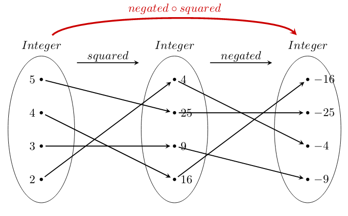
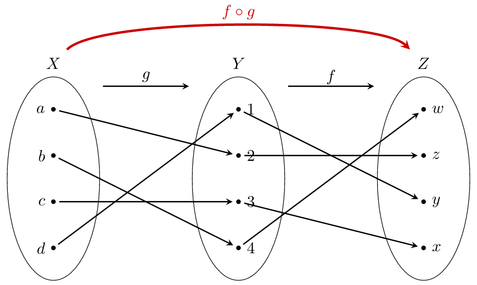
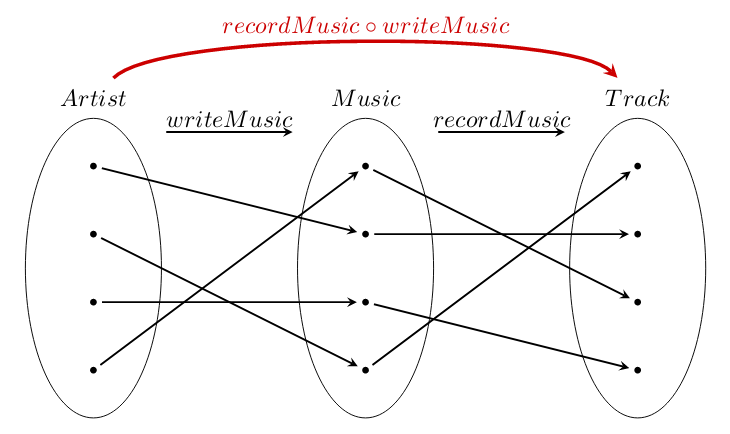

class: center, middle
# Use functions for a greater good
.footnote[By [Artem Kozlov](https://twitter.com/_akozlov) and [Gregor Trefs](https://twitter.com/gtrefs)]

---

.center[

]

---
# Promises of OOP

* Naturalness - OOP models the real world better because everything in the
world is an object.

--

* Reuse - OOP makes programming faster and easier because of the reuse of
existing, previously tested classes from a library. Reuse can also be
accomplished by inheritance.

--

* Development Life Cycle - OOP makes faster development of programs
because rapid prototyping of models is achieved due to the reuse of
existing models of a corporations processes.

--

* Maintenance - OOP makes maintenance easier because code only needs to
be changed in one place. This is made possible by encapsulation.

--

* Quality - OOP makes testing easier and more reliable because components
are existing and previously tested.

---

# Code Reuse

> Reusability has been difficult to achieve on early object-oriented projects because class libraries are not inherently very reusable. Searching through a class library, and understanding the details of code used to build the classes, can often cost more than rebuilding the classes from scratch. [...] 

--

> By 1997, it will be possible to buy 50% of an application as off-the-shelf components, effectively doubling productivity. By 1998, early adopters will be buying 50% of the application as external components and reusing internally generated components for another 25% of the application, effectively doubling productivity on an annual basis (OOPSLA 1995 Workshop proceedings)

--

# But still classes are everywhere
* object-oriented COBOL 2002 ISO standard
* ECMAScript 6 with classes


---
# Functions

> “Sometimes, the elegant implementation is just a function. Not a method. Not a class. Not a framework. Just a function.” – John Carmack

--

A function is a **relation** between a set of inputs and a set of permissible outputs with the property that each **input** is related to exactly **one output**.

--
.left-column[

]
--
.right-column[

]
---
# Pure Functions

> “A **pure function** is a function which: Given the *same input*, will always return the *same output*. Produces no **side effects**.” - <small>Wikipedia</small>

--

> “In computer science, a function or expression is said to have a **side effect** if, in addition to returning a value, it also modifies some **state** or has an observable interaction with calling functions or the outside world.” - <small>Wikipedia</small>

---
# Quiz (Functions)

.center[

]

--

What would be the result of: f(a) -> ???

--

What we expect: f(a) -> 2

--

What we get:

.center[

]

---
# Single Responsibility Principle (SRP)
> We want our systems to be composed of **many small classes**, not a few large ones. Each small class encapsulates a single responsibility, has a **single reason to change**, and **collaborates with a few others** to achieve the desired system behaviors. - (Clean Code, Robert C. Martin, 2008) 
--


.left-column[```Java
class Artist {
  String name;
  String email;
  Artist(String name, String email) {
    this.name = name;
    this.email = email;
  }
*  boolean isValid() {
*    return email.contains("@");
*  }
}
```]
--
.right-column[```Java
class EmailValidator {
  final String email;

  Email(String eMail) {
    this.email = eMail;
  }

* boolean isValid(){
*   return email.contains("@");
* }
}
```]
---
# Single Responsibility Principle (SRP)
`isValid` is a query about the state of the `Email`
```Java
class EmailValidator {
*  static boolean isValid(String email){
*    return email.contains("@");
*  }
}

isValid("lenzman@music.org");
```
--
and this can be modeled as a pure function
```Java
*Function<String, Boolean> containsAtSign = email -> email.contains("@");

containsAtSign.apply("lenzman@music.org");
```
---
# Functional interfaces (SAM) 
```Java
Label label = new HospitalRecords();
Music music = label.produceWith(new Artist() {
    @Override
*   public String name() {
*       return "Lenzman";
*   }
});
music.play(); // Producing Drum and Bass with famous Lenzman.
```
--
```Java
Label label = new HospitalRecords(); 
*Music music = label.produceWith(() -> "Lenzman");
music.play(); // Producing Drum and Bass with famous Lenzman.
```
---
# Functional interfaces (SAM) 
```Java
public interface Label {
*   Music produceWith(Artist artist);
}
class HospitalRecords implements Label {
    public Music produceWith(Artist artist) {
        return new DrumAndBass(artist);
    }
}
```
--
```Java
*Label label = artist -> new DrumAndBass(artist);
Music music = label.produceWith(() -> "Lenzman");
music.play(); // Producing Drum and Bass with famous Lenzman.
```
--
```Java
*Label label = DrumAndBass::new;
Music music = label.produceWith(() -> "Lenzman");
music.play(); // Producing Drum and Bass with famous Lenzman.
```
--
```Java
*Function<Artist, Music> label = DrumAndBass::new;
Music music = label.apply(() -> "Lenzman");
music.play(); // Producing Drum and Bass with famous Lenzman.
```

---

# Function Composition

```Java
Function<Integer, Integer> squared = a -> a * a;		
Function<Integer, Integer> negated = a -> -a;		
*Function<Integer, Integer> squaredAndNegated = negated.compose(squared);		
squaredAndNegated.apply(4); // -16		
```

--

.center[
  		
]

---

# Function Composition
```Java
<X,Y,Z> Function<X, Z> compose(Function<Y, Z> f, Function<X, Y> g) {
    return a -> f.apply(g.apply(a));
}
```

--

.center[
  
]

---

# Function Composition
```Java
Function<Artist, Music> writeMusic = Music::new;
Function<Music, Track> recordMusic = Track::new;
*Function<Artist, Track> produceTrack = recordMusic.compose(writeMusic);
```

--

.center[
  
]

---
# Music production pipeline 
```Java
Function<Artist, Music> writeMusic = Music::new;
Function<Music, Track> recordMusic = Track::new;
Function<List<Track>, Album> publishAlbum = Album::new;

Function<Artist, Track> produceTrack = recordMusic.compose(writeMusic);
*Function<Artist, List<Track>> produceTracks = ???
Function<Artist, Album> produceAlbum = publishAlbum.compose(produceTracks);

Artist someArtist = new Artist("Some Artist");
produceAlbum.apply(someArtist); // And we get the Album in the end
```


---
# Composition with High-Order functions
> A **higher-order** function is a function that takes other **functions as arguments** or **returns a function as result**. - <small>Haskell Wiki</small>

--

There is a big chance that you've already used them in other programming languages, like JavaScript:

 * map
 * flatMap
 * filter
 * reduce
 * .. etc

---

#map (Stream)

```Java
List<Integer> numbers = createRandomNumbers();
List<Character> letters =
    numbers.stream()
*     .map(n -> Character.forDigit(n, 10))
      .collect(Collectors.toList());

```

--
```Java
final Function<Artist, List<Track>> produceTracks =
  artist -> 
    Arrays.stream(new int[]{1, 2, 3, 4, 5, 6, 7, 8})
*     .map(i -> produceTrack.apply(artist))
      .collect(Collectors.toList());
```

--

Applies given function to each element of input and puts result in output.

--

.center[
  
]

--

```Java
<X,Y> Stream<Y> map(Stream<X> xs, Function<X, Y> f);
```

---
#map (Optional)

Lets say we need to get address for some Artist, but we know that some of them do not have any.
```Java
Optional<Artist> find(List<Artist> a, String name);

// find artist by name and if found, 
// return it address otherwise return string "UNKNOWN"
String address = 
    find(artists, "Michael Jackson")
      .map(artist -> artist.address)
      .orElse("UNKNOWN");
```  
--

Applies given function to content of the Optional and puts result in output.

--
```Java
<X,Y> Optional<Y> map(Optional<X> xs, Function<X, Y> f);
```

---
#map (CompletableFuture)

Lets say we want to download Tracks for some artist and then return their names.
```Java
CompletableFuture<Track> download(Artist artist);

// download all tracks for the given Artist and get their names
CompletableFuture<List<String>> address = 
    download(artist).thenApply(tracks -> 
        tracks.stream()
          .map(track -> track.name)
          .collect(Collectors.toList())
    );
  
```

--

Applies given function to completed future content and puts result in output.

--
```Java
<X,Y> CompletableFuture<Y> thenApply(CompletableFuture<X> xs, Function<X, Y> f);
```
--

_Unfortunately in JDK this method is called `thenApply` not `map`._

---
#map (Summary)
So different but similar at the same time:
```Java
<X,Y> Stream<Y> map(Stream<X> xs, Function<X, Y> f);
<X,Y> Optional<Y> map(Optional<X> x, Function<X, Y> f);
<X,Y> CompletableFuture<Y> thenApply(CompletableFuture<X> x, Function<X, Y> f);
```

--

```Java
<X,Y> Context<Y> map(Context<X> x, Function<X, Y> f);
```

--
#### Quiz
What is the name of this abstraction:

* ThingThatCanBeMappedOver
* SomeStrangeLongNameFromSomeWellKnownDomain
* Functor

---

#flatMap (Optional)
Lets say we want to find country code for the phone number of some artist.
```Java
Optional<Artist> find(List<Artist> a, String name);
Optional<PhoneNumber> phoneNumber(Address address);
Optional<CountryCode> countryCode(PhoneNumber phoneNumber);
```

--

_Lets try to use map to combine these functions._

--

```Java
// find artist by name and if found one then get phone numebr for the address 
// otherwise return string "UNKNOWN"
String phone = 
    find(artists, "Michael Jackson")  // Optional<Artist>
      .map(artist -> artist.address)  // Optional<Address>
      .map(phoneNumber)               // Optional<Optional<PhoneNumber>>
      .map(countryCode)               // Optional<Optional<Optional<CountryCode>>>
      ....
```
--
```Java
String phone = 
    find(artists, "Michael Jackson")  // Optional<Artist>
      .map(artist -> artist.address)  // Optional<Address>
      .flatMap(phoneNumber)           // Optional<PhoneNumber>
      .flatMap(countryCode)           // Optional<CountryCode>
      .orElse("UNKNOWN");             // String
```

---
#flatMap (Optional)

Map a function over an Optional and flatten the result by one-level
--

```Java
<X,Y> Optional<Y> flatMap(Optional<X> xs, Function<X, Optional<Y>> f);
```

---
#flatMap (Stream)

Example will be here

--

Map a function over a collection and flatten the result by one-level

--
.center[
  
]

--

```Java
<X,Y> Stream<Y> flatMap(Stream<X> xs, Function<X, Stream<Y>> f);
```

---

# flatMap (CompletableFuture)

```Java
CompletableFuture<Track> download(String name);
CompletableFuture<Void> play(Track track);

// download some track and then play it on some remote device
download(trackName).thenCompose(play);
  
```

--

Map a function over a CompletableFuture and flatten the result by one-level

--

```Java
<X,Y> CompletableFuture<Y> flatMap(
  CompletableFuture<X> xs, Function<X, CompletableFuture<Y>> f
);
```
--

_And again, unfortunately in JDK this method is called `thenCompose`._

---

#flatMap (Summary)

So different but similar at the same time:
```Java
<X,Y> Stream<Y> flatMap(Stream<X> xs, Function<X, Stream<Y>> f);
<X,Y> Optional<Y> flatMap(Optional<X> x, Function<X, Optional<Y>> f);
<X,Y> CompletableFuture<Y> thenCompose(
  CompletableFuture<X> x, Function<X, CompletableFuture<Y>> f
);
```

--
##Quiz
What is the name of this abstraction:

* ThingThatCanBeFlatMappedOver
* SomeStrangeLongNameFromSomeVeryWellKnownDomain
* Monad

---

# Combinators

Use **combinators** to combine simple **primitives** into more complex structures.

```Java
interface ArtistValidator extends Function<Artist, Optional<Artist>>{}
```
`ArtistValidator` is a function which determines whether an `Artist` is valid.
If the validation fails, the result is `Empty` otherwise it contains the valid `Artist` instance.
---
# Combinators
`ArtistValidator` **primitives** are basic validation rules.
```Java
static ArtistValidator hasMailWithAtSign(){
    return a -> a.email.contains("@")?Optional.of(a):Optional.empty();
}
```
`hasMailWithAtSign()` requires the artists e-mail to contain an `@` sign. If this is not the case
`Optional.empty()` is returned to signal that the validation failed.
--

```Java
static ArtistValidator nameIsNotEmpty(){
    return a -> a.name.trim().length()>0?Optional.of(a):Optional.empty();
}
```
`nameIsNotEmpty()` requires the artist to have mail with at least one letter. If this is not the case
`Optional.empty()` is returned to signal that the validation failed.
---
# Combinators
Manually applying each validation rule can be cumbersome. **Combinators** provide means to compose
different `ArtistValidator`s. 
--

```Java
static ArtistValidator and(ArtistValidator first, ArtistValidator second){
   return artist -> first.apply(artist).flatMap(second);
}

ArtistValidator v = and(nameIsNotEmpty(), hasMailWithAtSign());
```
`and()` requires that a given `Artist` is valid for all `ArtistValidator`s.
--

```Java
static ArtistValidator or(ArtistValidator first, ArtistValidator second){
   return artist -> {
       Optional<Artist> a = first.apply(artist);
       return a.isPresent()?a:second.apply(artist);
   }
}

ArtistValidator v = or(nameIsNotEmpty(), hasMailWithAtSign());
```
`or()` requires that a given `Artist` is valid for at least one `ArtistValidator`.
---
# Combinators
Since Java 8 `static` and `default` methods are allowed within `interface`s.

```Java
interface ArtistValidator extends Function<Artist, Optional<Artist>>{
    static ArtistValidator hasMailWithAtSign(){
        return holds(artist -> artist.email.contains("@"));
    }

    static ArtistValidator nameIsNotEmpty(){
        return holds(artist -> artist.name.trim().length()>0);
    }

    static ArtistValidator holds(Function<Artist, Boolean> p){
        return artist -> p.apply(artist)?Optional.of(artist):Optional.empty();
    }

    default ArtistValidator and(ArtistValidator other){
        return artist -> apply(artist).flatMap(other);
    }
}

ArtistValidator validator = nameIsNotEmpty().and(hasMailWithAtSign());
validator.apply(new Artist("Lenzman", "lenz@dnb.com")); // valid 
validator.apply(new Artist("", "lenz@dnb.com")); // invalid 
```
---

# Quiz
```Java
public void quiz(){
    Set<Function<String, String>> functions = new HashSet<>();

    functions.add(a -> a);
    functions.add(a -> a);
    functions.add(createNiceFunction());
    functions.add(createNiceFunction());

    System.out.println(functions.size()); // Output?
}

public Function<String, String> createNiceFunction(){
    return a -> a;
}
```
---
# Translation of Lambdas
.left-column-20[
## Desugar
]
.right-column-75[
Lambda bodies are lowered to private methods

```Java
public static void main(String[] args){
*   Function<String, String> f = a -> a;
    f.apply("hello");
}
```
```Java
private static String lambda$main$0(String a){
    return a;
}
```
]
---
# Translation of Lambdas
.left-column-20[
## Desugar
## Replace 
]
.right-column-75[
`invokeDynamic` substitutes lambda expression

```Java
Function<String, String> f = 
   indy(MH(metaFactory), MH(invokeVirtual Function.apply), 
        MH(invokeStatic lambda$main$0)());
```
At runtime 
- `metaFactory` used once to create a Factory (`CallSite`) which generates instances of the `Function` interface

- first `MethodHandle` identifies `Function.apply` as the functional interface method to which the lambda is being converted

- second `MethodHandle` identifies `lambda$main$0` as lambda method

JDK8: `CallSite` creates an inner-class-like class (see [`InnerClassLambdaMetafactory`](http://grepcode.com/file/repository.grepcode.com/java/root/jdk/openjdk/8-b132/java/lang/invoke/InnerClassLambdaMetafactory.java))
]
---
# Translation of Lambdas
.left-column-20[
## Desugar
## Replace 
## Why
]
.right-column-75[
> In selecting a strategy, there are two competing goals: maximizing flexibility for future optimization by not committing to a specific strategy, vs providing stability in the classfile representation. We can achieve both of these goals by using the invokedynamic feature [...].([Translation of Lambda Expressions](http://cr.openjdk.java.net/~briangoetz/lambda/lambda-translation.html), Brian Goetz 2012)

- `invokeDynamic` shifts Byte Code generation from compile time to run time

- Depending on the context different translation strategies may be used

- Translation of Lambdas can easily profit from new JVM features (cf. value types)
]
---
# Translation of Lambdas
.left-column-20[
## Desugar
## Replace 
## Why
## Perfomance
]
.right-column-75[
### Google Results: java 8 lambda performance

- Java 8 lambda performance is not great

- How Java 8 Lambdas and Streams Can Make Your Code 5 Times slower

- Big execution time difference between java Lambda vs Anonymous class

]
---
# Translation of Lambdas
.left-column-20[
## Desugar
## Replace 
## Why
## Perfomance
]
.right-column-75[
### Lambda expressions vs. data structures 
- Lambda expressions are on par and most often better than compareable imparative constructs [[1]](http://worldcomp-proceedings.com/proc/p2015/SER2509.pdf) 

- Due to advanced implementation techniques lambda expressions are much faster compared to same constrcuts in Scala or C#/F# [[2]](http://cgi.di.uoa.gr/~biboudis/clashofthelambdas.pdf)

- There is no runtime optimizaton for `Stream`s resulting in lower parallel perfomance compared to optimized constructs in Scala or C#/F# [[2]](http://cgi.di.uoa.gr/~biboudis/clashofthelambdas.pdf)

- Sequential streams are not faster than loops. Parallel streams may not be faster than sequential streams (cf. initialization costs). [[3]](https://jaxenter.com/java-performance-tutorial-how-fast-are-the-java-8-streams-118830.html)

]
---
# Summary

* Function is an useful abstraction that can improve reuse and maintainability of the code.

--

* Functions enable new types of useful abstractions.

--

* Use combinators to combine simple primitives into more complex structures.

--

* Performance-wise lambdas are  good enough for day-to-day use.

--

* Perfomance depends on the data structure

--

* Java is not a Functional Programming Language ...

---

# Abstractions In Functional Programming

.center[
  
]

_https://wiki.haskell.org/Typeclassopedia_

---
.center[
# Learn You a Haskell for Great Good!

]

---
class: center, middle
# Thank you
---
class: center, middle
# Appendix
---
# Literature 

[Fernandez, David, et al. "Has the Object-Oriented Paradigm Kept Its Promise?" (2002, APA)](http://ddi.cs.uni-potsdam.de/HyFISCH/Informieren/Programmiersprachen/OOPromisesAndReality.pdf)

The Object Technology Architecture: Business Objects for Corporate Information Systems Business Object Design and Implementation: OOPSLA ’95 Workshop Proceedings
